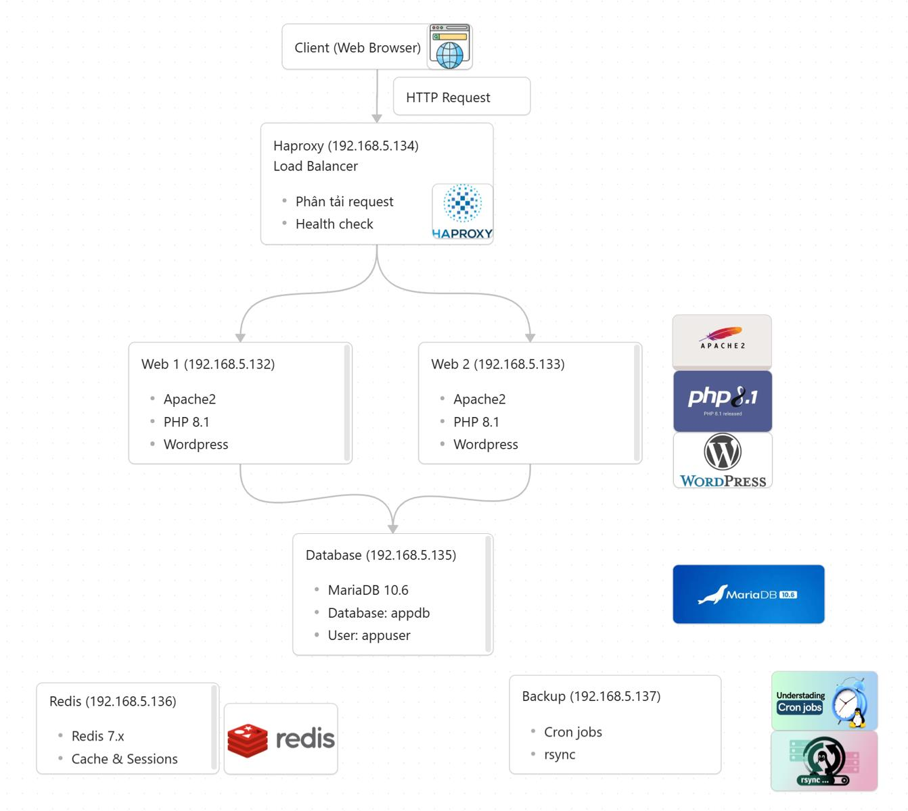

# Infrastructure Automation with Ansible


## Overview

This project demonstrates Infrastructure as Code (IaC) using Ansible to automate the provisioning and configuration of a multi-tier Linux infrastructure running on VMware.

The environment consists of six Ubuntu virtual machines providing web services, database, caching, load balancing, and automated backup. Using reusable Ansible roles and playbooks, the entire infrastructure can be deployed and configured consistently from a single control node.

## Objectives

* Deploy a multi-tier infrastructure using Ansible
* Automate Linux server provisioning and configuration
* Configure load balancing with HAProxy
* Deploy Apache, PHP, MariaDB, and Redis services
* Implement centralized configuration management using reusable Ansible roles
* Demonstrate Infrastructure as Code (IaC) practices

## Repository Structure

```text
ansible-system-automation/
│
├── img/
│   └── architecture.png 
│
├── Group15_FinalReport.pdf
│
├── Group15_Slide.pdf
│
└── README.md
```

## Demo repository
https://github.com/vuongdat67/NT132.Q11.ANTT-Group15

## Infrastructure Architecture


## Technologies Used

* Ansible
* Ubuntu Server
* VMware Workstation
* Apache HTTP Server
* PHP
* MariaDB
* Redis
* HAProxy
* OpenSSH
* YAML

## Key Features Explored

### Infrastructure Automation

* Agentless configuration management
* Infrastructure as Code (IaC)
* Idempotent playbook execution
* Modular Ansible roles

### Web Service Deployment

* Apache installation and configuration
* PHP environment provisioning
* Virtual Host configuration
* Automated WordPress deployment

### Load Balancing

* HAProxy deployment
* Backend server configuration
* High availability architecture

### Database & Cache

* MariaDB server provisioning
* Redis deployment and configuration
* Service initialization

### Backup Automation

* Automated backup scheduling
* Cron-based backup jobs
* Rsync configuration

### Configuration Management

* Inventory management
* Group variables
* Service-specific configuration
* Role-based automation

## Automation Workflow

### Environment Provisioning

Configured 6 Ubuntu virtual machines as managed hosts using Ansible inventory and SSH.

### Infrastructure Deployment

Executed a single playbook (`site.yml`) to provision:

* Web Servers
* HAProxy
* MariaDB
* Redis
* Backup Server

### Service Configuration

Automatically configured:

* Apache Virtual Hosts
* PHP runtime
* Database services
* Redis service
* HAProxy backend pools

### Application Deployment

Automated deployment of a WordPress application across multiple web servers.

### Validation

Verified successful deployment using:

* Ansible Ping Module
* Service Status Checks
* Web Application Testing
* Load Balancer Verification

## Key Findings

* Infrastructure provisioning becomes repeatable and consistent through Infrastructure as Code.
* Agentless automation simplifies Linux server management.
* Modular Ansible roles improve maintainability and reusability.
* Centralized playbooks significantly reduce manual deployment effort.
* Automated configuration minimizes human error while improving deployment speed.

## Skills Demonstrated

* Infrastructure as Code (IaC)
* Ansible Automation
* Linux System Administration
* Configuration Management
* VMware Virtualization
* HAProxy Load Balancing
* Apache & PHP Deployment
* MariaDB Administration
* Redis Administration
* SSH Automation
* YAML


